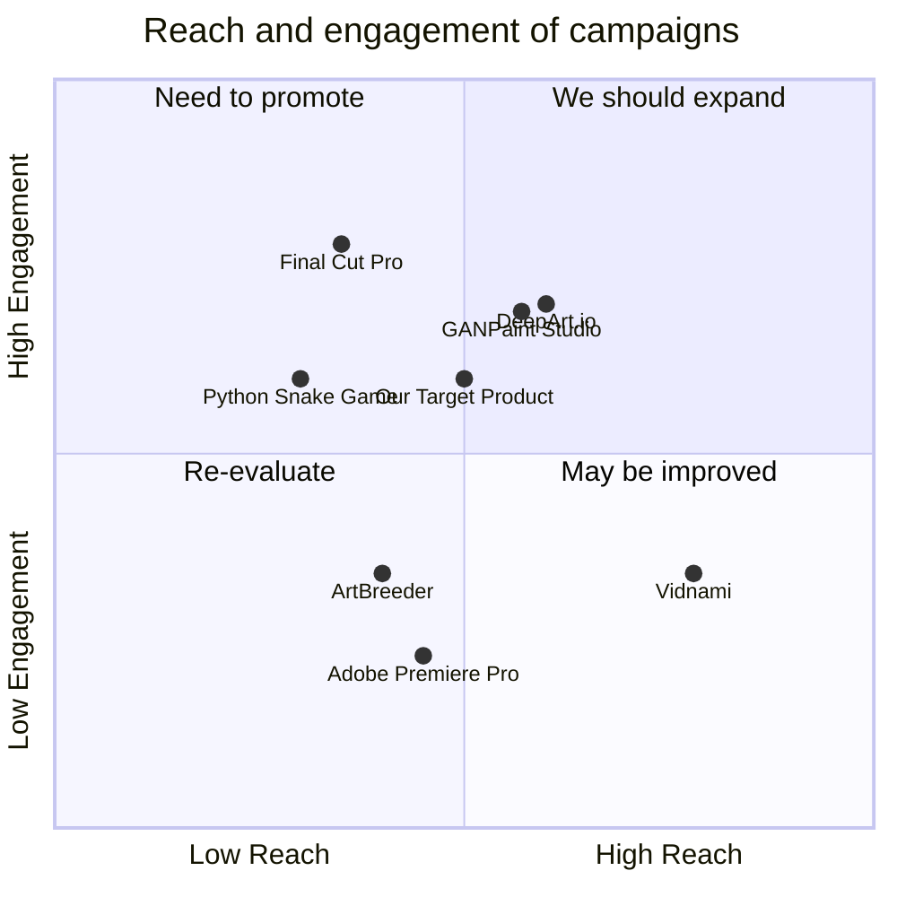

## Original Requirements:
[BOSS: Develop Project KUBRIK, a platform for generating hyperrealistic video advertisements using Generative Adversarial Networks; manage everything from researching GAN algorithms, ensuring frame-by-frame quality based on advertising and cinematography norms, to deploying a scalable and efficient system. Use this WORKFLOW:{ Objectives, Table of Contents, Pre-Initialization, Initialization, Data Ingestion & Concept Prototyping, Prototype Review and Approval, Key Frame Development, Frame-by-Frame Development, Quality Control, Pre-Final Review, Final Output, Resource and State Management, Logging, Monitoring, and Reporting, Post-Deployment Analytics } ]

## Product Goals:
```python
[
    "Develop a platform for generating hyperrealistic video advertisements using GANs",
    "Ensure frame-by-frame quality based on advertising and cinematography norms",
    "Deploy a scalable and efficient system"
]
```

## User Stories:
```python
[
    "As a marketing team member, I want to input the required elements for video ads via a user-friendly web-based UI",
    "As a reviewer, I want to easily review and approve or send back prototypes for revisions",
    "As a video ad creator, I want to generate key frames that define significant moments in the video ad based on the plot and storyboard",
    "As a video ad creator, I want to generate smooth video frames between key frames for a seamless viewing experience",
    "As a quality control team member, I want to ensure each frame meets advertising, marketing, and cinematography best practices"
]
```

## Competitive Analysis:
```python
[
    "Python Snake Game: A popular game developed in Python with a simple and addictive gameplay",
    "Adobe Premiere Pro: A professional video editing software with advanced features and tools",
    "GANPaint Studio: A tool that allows users to manipulate images using GANs and create hyperrealistic visuals",
    "Vidnami: A video creation platform that uses AI to automate the video production process",
    "ArtBreeder: An online platform that uses GANs to generate unique and creative images",
    "Final Cut Pro: A professional video editing software for Mac users with a wide range of editing tools",
    "DeepArt.io: An online platform that uses GANs to transform photos into artistic creations"
]
```

## Competitive Quadrant Chart:


## Requirement Analysis:
The product should be a platform that automates the generation of hyperrealistic video advertisements using GANs. It should have a user-friendly web-based UI for inputting the required elements of the video ads. The platform should generate prototypes for ad elements like products, characters, and settings using specialized GANs. The generated prototypes should be reviewed and approved or sent back for revisions by human reviewers. Key frames should be generated based on the plot and storyboard, and smooth video frames should be generated between key frames for a seamless viewing experience. The platform should ensure that each frame meets advertising, marketing, and cinematography best practices through quality control. Finally, the platform should produce the finalized hyperrealistic video ads in the desired format and resolution.

## Requirement Pool:
```python
[
    ("Develop a user-friendly web-based UI for inputting required elements", "P0"),
    ("Generate prototypes for ad elements using specialized GANs", "P0"),
    ("Implement a review and approval system for prototypes", "P1"),
    ("Generate key frames based on the plot and storyboard", "P0"),
    ("Generate smooth video frames between key frames", "P0")
]
```

## UI Design draft:
The UI should have a clean and intuitive design. It should include input fields for specifying the required elements of the video ads, such as products, characters, and settings. There should be a preview area where users can see the generated prototypes and key frames. The UI should also have buttons for approving or sending back prototypes for revisions. Additionally, there should be options for selecting the desired format and resolution of the finalized video ads. The layout should be responsive and adaptable to different screen sizes.

## Anything UNCLEAR:
There are no unclear points.