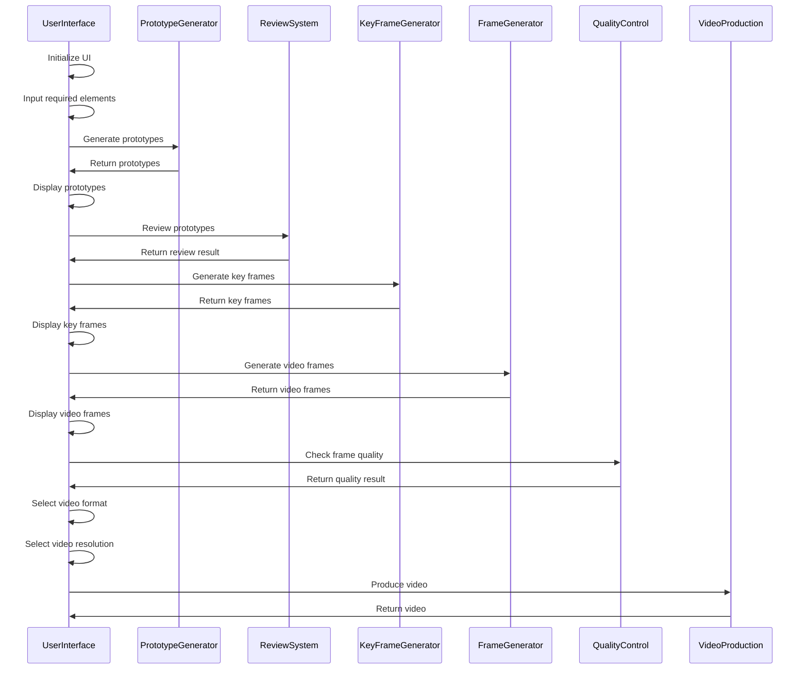

## Implementation approach:
To implement the platform for generating hyperrealistic video advertisements using GANs, we will use the following approach:

1. Research and select a suitable GAN algorithm for generating realistic video frames.
2. Design and develop a user-friendly web-based UI for inputting the required elements of the video ads.
3. Implement a prototype generation system using specialized GANs for ad elements like products, characters, and settings.
4. Integrate a review and approval system for prototypes, allowing reviewers to easily review and approve or send back prototypes for revisions.
5. Develop a key frame generation module that generates key frames based on the plot and storyboard of the video ad.
6. Implement a frame-by-frame generation module that generates smooth video frames between key frames for a seamless viewing experience.
7. Incorporate a quality control system that ensures each frame meets advertising, marketing, and cinematography best practices.
8. Develop a module for producing the finalized hyperrealistic video ads in the desired format and resolution.
9. Deploy the system on a scalable and efficient infrastructure to handle the generation of video ads at scale.

For each step, we will make use of open-source tools and libraries to simplify development and ensure code quality and maintainability.

## Python package name:
```python
"kubrik_ads"
```

## File list:
```python
[
    "main.py",
    "ui.py",
    "prototype_generator.py",
    "review_system.py",
    "key_frame_generator.py",
    "frame_generator.py",
    "quality_control.py",
    "video_production.py",
    "deployment.py"
]
```

## Data structures and interface definitions:

```mermaid
classDiagram
    class UI{
        +def __init__(self)
        +def input_elements(self) -> Dict[str, Any]
        +def display_prototypes(self, prototypes: List[Image])
        +def display_key_frames(self, key_frames: List[Image])
        +def display_video_frames(self, video_frames: List[Image])
        +def select_format(self) -> str
        +def select_resolution(self) -> str
    }
    class PrototypeGenerator{
        +def __init__(self)
        +def generate_prototypes(self, elements: Dict[str, Any]) -> List[Image]
    }
    class ReviewSystem{
        +def __init__(self)
        +def review_prototypes(self, prototypes: List[Image]) -> bool
    }
    class KeyFrameGenerator{
        +def __init__(self)
        +def generate_key_frames(self, plot: str, storyboard: List[str]) -> List[Image]
    }
    class FrameGenerator{
        +def __init__(self)
        +def generate_video_frames(self, key_frames: List[Image]) -> List[Image]
    }
    class QualityControl{
        +def __init__(self)
        +def check_frame_quality(self, frame: Image) -> bool
    }
    class VideoProduction{
        +def __init__(self)
        +def produce_video(self, video_frames: List[Image], format: str, resolution: str) -> Video
    }
    class Deployment{
        +def __init__(self)
        +def deploy_system(self)
    }
    class Image{
        +def __init__(self, path: str)
        +def display(self)
    }
    class Video{
        +def __init__(self, path: str)
        +def play(self)
    }
    UI "1" -- "1" PrototypeGenerator: uses
    UI "1" -- "1" ReviewSystem: uses
    UI "1" -- "1" KeyFrameGenerator: uses
    UI "1" -- "1" FrameGenerator: uses
    UI "1" -- "1" QualityControl: uses
    UI "1" -- "1" VideoProduction: uses
    PrototypeGenerator "1" -- "1" Image: returns
    ReviewSystem "1" -- "1" Image: accepts
    KeyFrameGenerator "1" -- "1" Image: returns
    FrameGenerator "1" -- "1" Image: returns
    QualityControl "1" -- "1" Image: accepts
    VideoProduction "1" -- "1" Video: returns
```


## Program call flow:


## Anything UNCLEAR:
The requirements are clear.